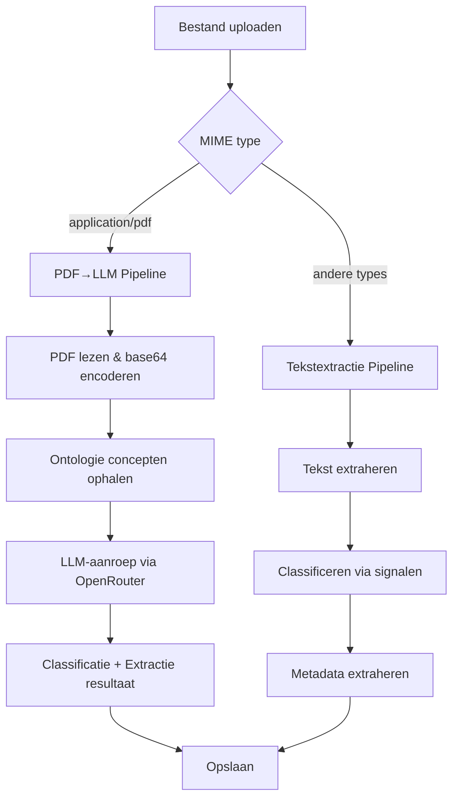

# PDF Verwerking via LLM — Technische Gids

> Documentatie voor de geïntegreerde PDF-verwerkingspipeline die PDF-bestanden direct naar een Large Language Model stuurt voor classificatie en metadata-extractie in één enkele aanroep.

## Overzicht

De knowledge-base backend ondersteunt twee verwerkingspipelines:

| Bestandstype | Pipeline | Stappen |
|---|---|---|
| **PDF** (`application/pdf`) | **PDF→LLM** | Store → Base64-encodering → Ontologie ophalen → LLM-aanroep → Classificatie + Extractie |
| **Overige** (txt, csv, docx, etc.) | **Tekstextractie** | Store → Tekst extraheren → Classificeren → Metadata extraheren |



## Architectuur

### Clean Architecture Lagen

De implementatie volgt het clean architecture principe met strikte scheiding van verantwoordelijkheden:

```
┌─────────────────────────────────────────────┐
│  Presentation Layer                          │
│  └── FileController (upload endpoint)        │
├─────────────────────────────────────────────┤
│  Application Layer                           │
│  ├── FileProcessingService (orchestratie)    │
│  ├── LLMClient (port/interface)              │
│  ├── ClassificationService                   │
│  └── MetadataExtractionService               │
├─────────────────────────────────────────────┤
│  Infrastructure Layer                        │
│  ├── OpenRouterLLMClient (adapter)           │
│  ├── OpenRouterClient (HTTP client)          │
│  ├── PipelineLogger (gekleurde logging)      │
│  └── LocalFileStorage                        │
├─────────────────────────────────────────────┤
│  Domain Layer                                │
│  ├── ContentPart (file_data veld)            │
│  ├── ProcessedFile                           │
│  └── ClassificationResult                    │
└─────────────────────────────────────────────┘
```

### Domein Entiteiten

#### ContentPart — Bestandsondersteuning

Het `ContentPart` dataclass ondersteunt nu drie content types:

```python
@dataclass
class ContentPart:
    type: str  # "text" | "image_url" | "file"
    text: str | None = None
    image_url: dict[str, str] | None = None
    file_data: dict[str, str] | None = None
```

Het `file` type wordt gebruikt om PDF-bestanden als base64-gecodeerde data-URLs naar OpenRouter te sturen:

```python
ContentPart(
    type="file",
    file_data={
        "file_data": "data:application/pdf;base64,JVBERi0xLjQ...",
        "filename": "factuur_2025.pdf",
    },
)
```

#### LLMPdfProcessingRequest / Response

```python
@dataclass
class LLMPdfProcessingRequest:
    pdf_base64: str                                      # Base64-gecodeerde PDF
    filename: str                                        # Oorspronkelijke bestandsnaam
    available_concepts: list[dict[str, Any]]             # Ontologie concepten
    template_fields_by_concept: dict[str, list[dict]]    # Extractie-templates per concept

@dataclass  
class LLMPdfProcessingResponse:
    concept_id: str                         # Geclassificeerd concept
    confidence: float                       # Betrouwbaarheidsscore (0.0-1.0)
    reasoning: str                          # Motivatie voor classificatie
    extracted_properties: dict[str, Any]    # Geëxtraheerde metadata
    summary: str                            # Samenvatting van het document
```

## Configuratie

### Omgevingsvariabelen

| Variabele | Standaard | Beschrijving |
|---|---|---|
| `OPENROUTER_API_KEY` | *(vereist)* | API-sleutel voor OpenRouter |
| `OPENROUTER_BASE_URL` | `https://openrouter.ai/api/v1` | OpenRouter API basis-URL |
| `OPENROUTER_APP_NAME` | `knowledge-base` | Applicatienaam in headers |
| `PDF_PROCESSING_MODEL` | `z-ai/glm-5` | LLM model voor PDF-verwerking |
| `CLASSIFICATION_MODEL` | `anthropic/claude-sonnet-4-20250514` | Model voor tekst-classificatie |

### Voorbeeld `.env`

```env
OPENROUTER_API_KEY=sk-or-v1-xxxxx
PDF_PROCESSING_MODEL=z-ai/glm-5
CLASSIFICATION_MODEL=anthropic/claude-sonnet-4-20250514
```

## PDF→LLM Pipeline — Gedetailleerde Werking

### 1. Bestandsdetectie

De `FileProcessingService._process_file()` methode controleert het MIME type:

```python
if pf.mime_type == "application/pdf" and self._llm_client and self._ontology_repo:
    await self._process_pdf_via_llm(pf)
else:
    await self._process_via_text_extraction(pf)
```

**Fallback**: Als de LLM client niet beschikbaar is (bijv. geen API-key), valt het systeem terug op de standaard tekstextractie-pipeline.

### 2. PDF Encodering

Het PDF-bestand wordt van schijf gelezen en naar base64 geconverteerd:

```python
pdf_bytes = Path(pf.stored_path).read_bytes()
pdf_base64 = base64.b64encode(pdf_bytes).decode("ascii")
```

### 3. Ontologie Ophalen

Alle classificeerbare concepten (niet-abstract, met extractie-template) worden opgehaald, inclusief hun metadata-templates:

```python
classifiable = await self._ontology_repo.get_classifiable_concepts()

for concept in classifiable:
    available_concepts.append({
        "id": concept.id,
        "label": concept.label,
        "description": concept.description,
        "synonyms": concept.synonyms,
        "hints": concept.extraction_template.classification_hints,
    })
    
    template_fields_by_concept[concept.id] = [
        {"name": prop.name, "type": prop.type, "required": prop.required}
        for prop in concept.properties
    ]
```

### 4. LLM Aanroep

De PDF wordt als `file` content part meegestuurd samen met een uitgebreide prompt die het LLM instrueert om:
1. Het document te **classificeren** naar het best passende concept
2. **Metadata** te extraheren volgens het template van het gekozen concept

De response is een enkel JSON-object met zowel classificatie als extractie.

### 5. Domein-mapping

De LLM-response wordt vertaald naar bestaande domein-entiteiten:

- `ClassificationResult` met `ClassificationSignal(method="llm_pdf_processing")`
- `ExtractedProperty` objecten met genormaliseerde waarden via `_normalize_value()`

## Gekleurde Console Logging

### PipelineLogger

De `PipelineLogger` klasse biedt kleurgecodeerde logging per pipeline-fase:

| Fase | Kleur | Icoon | Gebruik |
|---|---|---|---|
| `UPLOAD` | Groen | 📤 | Bestandsontvangst |
| `STORAGE` | Groen | 💾 | Opslag bevestiging |
| `TEXT_EXTRACTION` | Geel | 📝 | Tekstextractie |
| `PDF_LLM` | Magenta | 🤖 | PDF→LLM verwerking |
| `CLASSIFICATION` | Cyaan | 🏷️ | Classificatie |
| `METADATA` | Blauw | 📊 | Metadata extractie |
| `PIPELINE` | Wit | ⚙️ | Pipeline-routing |
| `COMPLETE` | Groen | ✅ | Voltooiing |
| `ERROR` | Rood | ❌ | Foutmeldingen |

### Gebruik

```python
from app.infrastructure.logging.colored_logger import PipelineLogger, PipelineStage

plog = PipelineLogger("MyService")

plog.step_start(PipelineStage.UPLOAD, "Bestand ontvangen", size=1024)
plog.detail("Extra informatie", key="waarde")
plog.step_complete(PipelineStage.UPLOAD, "Opgeslagen")
plog.step_error(PipelineStage.ERROR, "Fout opgetreden", error=exc)
plog.stats(verwerkt=10, fouten=0)

# Timed context manager
with plog.timed_step(PipelineStage.TEXT_EXTRACTION, "Tekst extraheren"):
    text = await extractor.extract(path)
# → Automatisch: "⏱ Tekst extraheren (1.23s)"
```

## Testen

### Testafspraken

Alle fake `LLMClient` subklassen in tests moeten de `process_pdf` methode implementeren:

```python
class FakeLLMClient(LLMClient):
    async def classify_document(self, request): ...
    async def extract_metadata(self, request): ...
    async def ocr_image(self, request): ...
    async def process_pdf(self, request):  # Verplicht!
        return LLMPdfProcessingResponse(concept_id="", confidence=0.0)
```

### Tests Uitvoeren

```bash
cd backend
.venv/bin/python -m pytest tests/ -v
```

## Dependency Injection

De `dependencies.py` module configureert de volledige keten:

```python
llm_client = OpenRouterLLMClient(
    openrouter_client=openrouter,
    model=settings.classification_model,
    pdf_model=settings.pdf_processing_model,  # z-ai/glm-5
)

yield FileProcessingService(
    file_repository=file_repository,
    file_storage=storage,
    text_extractor=extractor,
    classification_service=classifier,
    metadata_extractor=metadata_extractor,
    llm_client=llm_client,              # Nieuw: directe LLM toegang
    ontology_repo=ontology_repository,   # Nieuw: ontologie voor PDF pipeline
)
```
