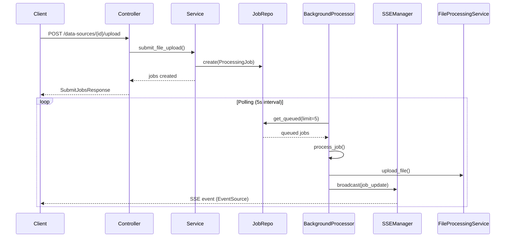

# Data Sources Module — Technische Documentatie

## 1. Inleiding

De Data Sources module biedt een flexibele architectuur voor het beheren van meerdere databronnen (bestandsuploads en websites) met automatische achtergrondverwerking. Het systeem maakt gebruik van een in-process asyncio daemon die een database job-wachtrij pollt, en levert real-time statusupdates via Server-Sent Events (SSE).

### Kernfuncties

- **Multi-source ondersteuning**: File uploads en website URLs als databronnen
- **Achtergrondverwerking**: Asyncio daemon met database job queue
- **Real-time updates**: SSE voor live verwerkingsstatus in de browser
- **Clean Architecture**: Strikte scheiding tussen domain, application, infrastructure en presentation lagen

## 2. Architectuur

### 2.1 Lagen Overzicht

```
┌──────────────────────────────────────────────┐
│  Presentation Layer                          │
│  data_sources_controller.py (REST + SSE)     │
├──────────────────────────────────────────────┤
│  Application Layer                           │
│  DataSourceService │ BackgroundProcessor     │
│  SSEManager        │ Pydantic Schemas        │
├──────────────────────────────────────────────┤
│  Domain Layer                                │
│  DataSource Entity │ ProcessingJob Entity    │
│  DataSourceType    │ JobStatus               │
├──────────────────────────────────────────────┤
│  Infrastructure Layer                        │
│  SQLAlchemy Models │ Repository Implementaties│
│  Database Session  │ File Storage            │
└──────────────────────────────────────────────┘
```

### 2.2 Data Flow



## 3. Domain Layer

### 3.1 DataSource Entity

De `DataSource` entiteit representeert een geregistreerde databron.

```python
from app.domain.entities import DataSource, DataSourceType

# Beschikbare types
class DataSourceType(str, Enum):
    FILE_UPLOAD = "file_upload"
    WEBSITE = "website"

# Voorbeeld instantie
source = DataSource(
    name="Facturen 2024",
    source_type=DataSourceType.FILE_UPLOAD,
    description="Alle inkoopfacturen van 2024",
)
```

**Velden:**

| Veld | Type | Beschrijving |
|------|------|-------------|
| `id` | `str` | UUID, automatisch gegenereerd |
| `name` | `str` | Weergavenaam |
| `source_type` | `DataSourceType` | Type databron |
| `description` | `str` | Optionele beschrijving |
| `config` | `dict` | Type-specifieke configuratie |
| `created_at` | `datetime` | Aanmaakdatum |
| `updated_at` | `datetime` | Laatst bijgewerkt |

### 3.2 ProcessingJob Entity

De `ProcessingJob` entiteit representeert een verwerkingstaak in de wachtrij.

```python
from app.domain.entities import ProcessingJob, JobStatus

# Status lifecycle
class JobStatus(str, Enum):
    QUEUED = "queued"          # Wacht op verwerking
    PROCESSING = "processing"  # Wordt verwerkt
    COMPLETED = "completed"    # Succesvol afgerond
    FAILED = "failed"          # Fout opgetreden
```

**Lifecycle methoden:**

```python
job = ProcessingJob(
    data_source_id="...",
    resource_identifier="/pad/naar/bestand.pdf",
    resource_type="file",
)

# Status overgangen
job.mark_processing("Bezig met extractie...")
job.mark_completed(result_file_id="abc123")
job.mark_failed("Bestand niet gevonden")
```

## 4. Infrastructure Layer

### 4.1 ORM Modellen

De SQLAlchemy modellen `DataSourceModel` en `ProcessingJobModel` worden automatisch aangemaakt bij het opstarten van de applicatie via `Base.metadata.create_all`.

### 4.2 Repository Pattern

Abstracte interfaces definiëren het contract:

```python
class DataSourceRepository(ABC):
    async def create(self, source: DataSource) -> DataSource
    async def get_by_id(self, source_id: str) -> DataSource | None
    async def list_all(self) -> list[DataSource]
    async def delete(self, source_id: str) -> bool

class ProcessingJobRepository(ABC):
    async def create(self, job: ProcessingJob) -> ProcessingJob
    async def get_queued(self, limit: int = 10) -> list[ProcessingJob]
    async def update(self, job: ProcessingJob) -> ProcessingJob
    async def delete_by_data_source(self, data_source_id: str) -> int
```

## 5. Application Layer

### 5.1 DataSourceService

Beheert CRUD operaties en job-indiening:

```python
service = DataSourceService(
    source_repo=source_repo,
    job_repo=job_repo,
    file_storage=storage,
)

# Source aanmaken
source = await service.create_source(
    name="Blog Artikelen",
    source_type=DataSourceType.WEBSITE,
)

# URLs indienen voor verwerking
jobs = await service.submit_urls(source.id, [
    "https://example.com/artikel-1",
    "https://example.com/artikel-2",
])
```

### 5.2 BackgroundProcessor

De `BackgroundProcessor` draait als asyncio task binnen de FastAPI lifespan:

```python
# In main.py lifespan
processor = BackgroundProcessor(
    job_repo=job_repo,
    file_processing_service=file_service,
    sse_manager=sse_manager,
)
await processor.start()   # Start polling loop
yield                      # App draait
await processor.stop()     # Graceful shutdown
```

**Kenmerken:**
- Pollt elke 5 seconden de `processing_jobs` tabel
- Verwerkt maximaal 5 jobs per cyclus
- File jobs: leest bestand van schijf, verwerkt via `FileProcessingService`
- URL jobs: haalt pagina op met `httpx`, stript HTML, verwerkt als tekst
- Broadcast statusupdates via `SSEManager`

### 5.3 SSEManager

Beheert SSE client-verbindingen en broadcast events:

```python
sse_manager = SSEManager()

# Client abonneert zich (in controller)
async def stream():
    return StreamingResponse(sse_manager.subscribe(), media_type="text/event-stream")

# Broadcast vanuit BackgroundProcessor
await sse_manager.broadcast("job_update", {
    "id": "...",
    "status": "completed",
    ...
})
```

## 6. Presentation Layer

### 6.1 API Endpoints

| Methode | Pad | Beschrijving |
|---------|-----|-------------|
| `POST` | `/api/v1/data-sources/` | Nieuwe databron aanmaken |
| `GET` | `/api/v1/data-sources/` | Alle databronnen ophalen |
| `GET` | `/api/v1/data-sources/{id}` | Enkele databron ophalen |
| `DELETE` | `/api/v1/data-sources/{id}` | Databron en bijbehorende jobs verwijderen |
| `POST` | `/api/v1/data-sources/{id}/upload` | Bestanden uploaden (multipart/form-data) |
| `POST` | `/api/v1/data-sources/{id}/submit-urls` | URLs indienen voor verwerking |
| `GET` | `/api/v1/data-sources/{id}/jobs` | Jobs voor specifieke bron |
| `GET` | `/api/v1/data-sources/jobs/all` | Alle verwerkingsjobs |
| `GET` | `/api/v1/data-sources/jobs/stream` | SSE real-time statusstream |

### 6.2 Request/Response Voorbeelden

**Databron aanmaken:**
```json
POST /api/v1/data-sources/
{
    "name": "Bedrijfsdocumenten",
    "source_type": "file_upload",
    "description": "Interne bedrijfsdocumenten voor classificatie"
}
```

**URLs indienen:**
```json
POST /api/v1/data-sources/{id}/submit-urls
{
    "urls": [
        "https://example.com/pagina-1",
        "https://example.com/pagina-2"
    ]
}
```

**SSE Event:**
```
event: job_update
data: {"id":"abc123","status":"completed","result_file_id":"def456",...}
```

## 7. Frontend Integratie

### 7.1 TypeScript Types

Alle types staan in `src/types/data-sources.ts` en spiegelen de backend Pydantic schemas.

### 7.2 API Client

De `dataSourcesApi` (in `src/lib/data-sources-api.ts`) biedt functies voor alle endpoints:

```typescript
import { dataSourcesApi } from '@/lib/data-sources-api';

// CRUD
const sources = await dataSourcesApi.list();
const source = await dataSourcesApi.create({ name: "Test", source_type: "file_upload" });

// Upload
const result = await dataSourcesApi.uploadFiles(source.id, files);

// URLs
const urlResult = await dataSourcesApi.submitUrls(source.id, { urls: ["https://..."] });
```

### 7.3 React Hooks

**`useDataSources`** — CRUD operaties met state management:
```typescript
const { sources, loading, error, createSource, deleteSource, refetch } = useDataSources();
```

**`useProcessingJobs`** — Real-time updates via SSE:
```typescript
const { jobs, loading, error, refetch } = useProcessingJobs(sourceId);
// jobs worden automatisch bijgewerkt via EventSource
```

### 7.4 DataSourcesPage

De pagina bevat drie tabs:

1. **Data Sources** — Registreer en beheer databronnen (kaarten met type-iconen)
2. **Upload & Submit** — Upload bestanden of dien URLs in (per geselecteerde bron)
3. **Processing** — Real-time verwerkingsoverzicht met status-indicatoren

## 8. Configuratie

### Omgevingsvariabelen

| Variabele | Standaard | Beschrijving |
|-----------|-----------|-------------|
| `UPLOAD_DIR` | `./uploads` | Map voor opgeslagen bestanden |
| `VITE_API_BASE_URL` | `/api/v1` | Frontend API base URL |

### Database

De module voegt twee tabellen toe:
- `data_sources` — Geregistreerde databronnen
- `processing_jobs` — Verwerkingsjobs wachtrij

Tabellen worden automatisch aangemaakt bij het opstarten via `Base.metadata.create_all`.
