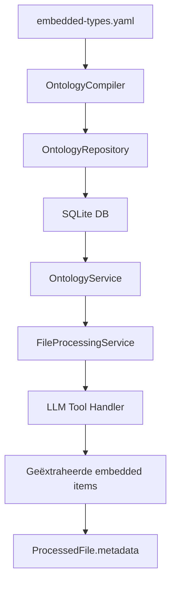

# Ingebedde Typen — Ontwikkelaarsdocumentatie

## Inleiding

Ingebedde typen (embedded types) zijn **gestructureerde waarde-objecten** die bestaan binnen een ouderconcept in de ontologie. Ze hebben geen onafhankelijke identiteit — ze worden altijd geëxtraheerd als onderdeel van een ouder-document. Voorbeelden zijn `InvoiceLineItem` (factuurregels), `PostalAddress` (postadressen), en `ContractClause` (contractclausules).

> [!IMPORTANT]
> Ingebedde typen worden opgeslagen in hun eigen databasetabellen voor optimale bevraagbaarheid, maar zijn conceptueel altijd onderdeel van een ouderconcept.

## Architectuur

### Lagenmodel

```
┌─────────────────────────────────────────────────────┐
│  Presentatie  │  ontology_controller.py              │
│               │  → GET /concepts/{id} met embedded   │
├─────────────────────────────────────────────────────┤
│  Applicatie   │  OntologyCompiler                    │
│               │  → Parst embedded-types.yaml         │
│               │  OntologyService                     │
│               │  → Resolveert met overerving         │
│               │  FileProcessingService               │
│               │  → Stuurt schema's naar LLM          │
├─────────────────────────────────────────────────────┤
│  Domein       │  EmbeddedType, EmbeddedTypeProperty  │
│               │  → Dataclasses in ontology_concept.py│
├─────────────────────────────────────────────────────┤
│  Infra        │  EmbeddedTypeModel                   │
│               │  EmbeddedTypePropertyModel            │
│               │  → SQLAlchemy / SQLite               │
└─────────────────────────────────────────────────────┘
```

### Dataflow



## Definitiebestand

Ingebedde typen worden gedefinieerd in `backend/data/embedded-types.yaml`. Het bestand is opgedeeld in secties:

| Sectie | Beschrijving | Voorbeeld |
|--------|-------------|-----------|
| `foundation_value_types` | Basis-waardetypen (L1) | `PostalAddress`, `MoneyValue` |
| `entity_embedded_types` | Entiteit-gerelateerd (L2) | `ContactMethod`, `IdentityDocument` |
| `artifact_embedded_types` | Document-gerelateerd (L2) | `InvoiceLineItem`, `ContractClause` |
| `process_embedded_types` | Proces-gerelateerd (L2) | `ApprovalStep`, `PaymentScheduleEntry` |

### Voorbeeld YAML-definitie

```yaml
foundation_value_types:
  - id: PostalAddress
    layer: L1
    description: Een gestructureerd postadres.
    applies_to:
      - Person
      - Organization
    synonyms:
      - adres
      - woonadres
    properties:
      - name: street
        type: string
        required: true
        description: Straatnaam en huisnummer
      - name: city
        type: string
        required: true
      - name: postal_code
        type: string
      - name: country
        type: string
        required: true
```

### Belangrijke velden

- **`id`** — Unieke identifier (PascalCase)
- **`layer`** — `L1` (basis) of `L2` (domein-specifiek)
- **`applies_to`** — Lijst van concepten waaraan dit type kan worden gekoppeld
- **`properties`** — Getypeerde eigenschappen met optionele `values` voor enums

## Domein-entiteiten

### `EmbeddedType`

```python
@dataclass
class EmbeddedType:
    id: str                                    # "PostalAddress"
    layer: str                                 # "L1" of "L2"
    description: str = ""
    applies_to: list[str] = field(...)         # ["Person", "Organization"]
    synonyms: list[str] = field(...)
    properties: list[EmbeddedTypeProperty] = field(...)
```

### `EmbeddedTypeProperty`

```python
@dataclass
class EmbeddedTypeProperty:
    name: str                     # "street"
    type: str                     # "string", "enum", "decimal"
    required: bool = False
    description: str = ""
    values: list[str] = field(...)  # Enum-keuzes: ["Phone", "Email"]
```

## Compilatie

De `OntologyCompiler` parst het bestand bij het opstarten van de applicatie:

```python
compiler = OntologyCompiler(
    l1_dir="data/l1",
    l2_dir="data/l2",
    repository=repository,
    embedded_types_file="data/embedded-types.yaml",  # ← Nieuw
)
await compiler.compile()
```

De compiler:
1. Itereert over alle top-level secties in het YAML-bestand
2. Bouwt `EmbeddedType` domein-entiteiten per definitie
3. Slaat ze op via `repository.save_embedded_type()`

## Overerving

De `OntologyService.get_embedded_types_for_concept()` methode loopt de overervingsketen af:

```python
# PostalAddress applies_to: ["Entity"]
# Person erft van Entity
types = await service.get_embedded_types_for_concept("Person")
# → Bevat PostalAddress (geërfd via Entity)
```

Dit werkt door alle voorouders op te vragen en voor elk concept de gekoppelde embedded types te verzamelen.

## Bestandsverwerking

### PDF-verwerking (LLM Tool-Calling)

Wanneer het LLM een `get_extraction_schema` tool-call uitvoert, bevat het antwoord nu ook de embedded type definities:

```json
{
  "concept_id": "Invoice",
  "properties": [...],
  "embedded_types": [
    {
      "id": "InvoiceLineItem",
      "description": "Een individuele post op een factuur.",
      "properties": [
        {"name": "description", "type": "string", "required": true},
        {"name": "quantity", "type": "integer", "required": true},
        {"name": "unit_price", "type": "decimal", "required": true}
      ]
    }
  ]
}
```

### Opslag van geëxtraheerde items

Geëxtraheerde embedded items worden opgeslagen in het `metadata` veld van `ProcessedFile` onder de sleutel `_embedded_items`:

```python
pf.metadata = {
    "invoice_number": {"value": "2024-001", "confidence": 0.95},
    "_embedded_items": {
        "InvoiceLineItem": [
            {"description": "Consultancy", "quantity": 10, "unit_price": 150.00},
            {"description": "Reiskosten", "quantity": 1, "unit_price": 45.50},
        ]
    }
}
```

## API-endpoints

### `GET /api/v1/ontology/concepts/{concept_id}`

Het detail-endpoint bevat nu een `embedded_types` lijst:

```json
{
  "id": "Invoice",
  "layer": "L2",
  "embedded_types": [
    {
      "id": "InvoiceLineItem",
      "layer": "L2",
      "description": "Een individuele post op een factuur.",
      "applies_to": ["Invoice", "CreditNote"],
      "properties": [...]
    }
  ]
}
```

### `GET /api/v1/ontology/stats`

Bevat nu een `embedded_type_count` veld.

## Database-schema

### Tabel `embedded_types`

| Kolom | Type | Beschrijving |
|-------|------|-------------|
| `id` | `VARCHAR(100)` PK | Unieke identifier |
| `layer` | `VARCHAR(10)` | L1 of L2 |
| `description` | `TEXT` | Beschrijving |
| `applies_to_json` | `TEXT` | JSON-array van concept-IDs |
| `synonyms_json` | `TEXT` | JSON-array van synoniemen |

### Tabel `embedded_type_properties`

| Kolom | Type | Beschrijving |
|-------|------|-------------|
| `id` | `INTEGER` PK | Auto-increment |
| `embedded_type_id` | `VARCHAR(100)` FK | Referentie naar `embedded_types` |
| `name` | `VARCHAR(100)` | Naam van de eigenschap |
| `type` | `VARCHAR(100)` | Gegevenstype |
| `required` | `BOOLEAN` | Verplicht veld |
| `description` | `TEXT` | Beschrijving |
| `values_json` | `TEXT` | JSON-array voor enum-waarden |

## Testen

De testsuite bevat 7 nieuwe tests:

### Compiler-tests (`TestEmbeddedTypeCompiler`)
- `test_compile_embedded_types` — Parst multi-sectie YAML correct
- `test_compile_no_embedded_types_file` — Werkt zonder bestand
- `test_embedded_types_cleared_on_recompile` — Wisting bij hercompilatie

### Service-tests (`TestEmbeddedTypeService`)
- `test_get_embedded_types_direct` — Directe koppeling via `applies_to`
- `test_get_embedded_types_inherited` — Overerving via voorouders
- `test_get_embedded_types_nonexistent_concept` — Lege lijst voor onbekend concept
- `test_stats_include_embedded_type_count` — Statistieken bevatten telling

### Tests uitvoeren

```bash
cd backend
python -m pytest tests/unit/test_ontology.py -v
```
