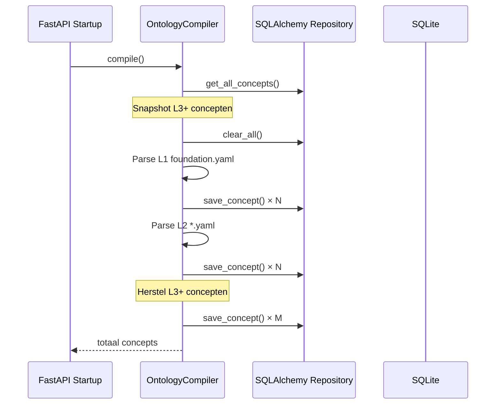

# Ontologie Beheer Gids

> Ontwikkelaarsgids voor het ontologie-beheersysteem — architectuur, API-referentie en gebruiksvoorbeelden.

---

## Inhoudsopgave

1. [Theoretische achtergrond](#theoretische-achtergrond)
2. [Gelaagde architectuur](#gelaagde-architectuur)
3. [Compilatie & levenscyclus](#compilatie--levenscyclus)
4. [L3-concepten: gebruikersdefinities](#l3-concepten-gebruikersdefinities)
5. [API-referentie](#api-referentie)
6. [Frontend ontologie-pagina](#frontend-ontologie-pagina)
7. [Voorbeelden](#voorbeelden)

---

## Theoretische achtergrond

Een **ontologie** is een formeel model dat de begrippen (concepten) binnen een kennisdomein beschrijft, samen met hun eigenschappen, relaties en hiërarchie. In dit systeem wordt de ontologie gebruikt om documenten automatisch te classificeren en gestructureerde kennis te extraheren.

### Kernprincipes

| Principe | Beschrijving |
|---|---|
| **Overerving** | Een concept erft alle eigenschappen van zijn ouder (`inherits`). Kindeigenschappen overschrijven ouder-eigenschappen met dezelfde naam. |
| **Lagen (Layers)** | Vier niveaus van specificiteit: L1 → L2 → L3 → L4. |
| **Pilaren** | Concepten zijn georganiseerd in vier pilaren: `entities`, `processes`, `artifacts`, `domain_knowledge`. |
| **Mixins** | Herbruikbare eigenschapsbundels die op meerdere concepten worden toegepast. |
| **Extractietemplates** | Classificatiehinten en bestandspatronen voor automatische documentherkenning. |

---

## Gelaagde architectuur

```
L1 — Foundation (voorgedefinieerd)
│   Basisbegrippen: Thing, Entity, Object, Process, Artifact
│   Gecompileerd uit: ontology/l1/foundation.yaml
│
├── L2 — Enterprise (voorgedefinieerd)
│   │   Bedrijfsconcepten: Document, Invoice, Contract, Person
│   │   Gecompileerd uit: ontology/l2/*.yaml
│   │
│   └── L3 — Industry (gebruikersgedefinieerd)
│       │   Industriespecifieke concepten, bijv. "AcmeInvoice"
│       │   Opgeslagen in: SQLite database (niet in YAML)
│       │
│       └── L4 — Organisation (toekomstige uitbreiding)
```

### Laagbeschrijvingen

| Laag | Scope | Bron | Bewerkbaar |
|------|-------|------|-----------|
| **L1** | Universele foundation-concepten | `ontology/l1/foundation.yaml` | ❌ Read-only |
| **L2** | Bedrijfsdomein-concepten | `ontology/l2/*.yaml` | ❌ Read-only |
| **L3** | Industrie-specifieke concepten | SQLite database | ✅ Create & Delete |
| **L4** | Organisatie-specifieke concepten | _(toekomstig)_ | — |

---

## Compilatie & levenscyclus

Bij het opstarten van de backend compileert de `OntologyCompiler` alle YAML-bestanden:



### Belangrijke eigenschap: L3-behoud

Bij hercompilatie worden L3-concepten **bewaard**. De compiler:

1. Slaat een snapshot op van alle L3+-concepten vóór `clear_all()`
2. Compileert L1 en L2 vanuit YAML
3. Herstelt de L3+-concepten na compilatie

Dit betekent dat door gebruikers aangemaakte concepten **niet verloren gaan** bij een herstart.

---

## L3-concepten: gebruikersdefinities

### Aanmaken

Een L3-concept moet:

- Een **uniek ID** hebben (geen bestaand concept mag hetzelfde ID hebben)
- Een **bestaand ouderconcept** hebben (`inherits` moet verwijzen naar een geldig concept)
- Eigenschappen definiëren die specifiek zijn voor de industrie

### Verwijderen

Alleen L3+-concepten mogen verwijderd worden. Beschermingsregels:

| Regel | Foutmelding |
|-------|-------------|
| L1/L2 concept verwijderen | `ProtectedConceptError`: "Cannot delete L1/L2 concept" |
| Concept met kinderen verwijderen | `ProtectedConceptError`: "Cannot delete concept with child concepts" |
| Niet-bestaand concept | Retourneert `False` (404 via API) |

### Eigenschap-overerving

Wanneer een concept wordt opgevraagd, worden **alle geërfde eigenschappen** opgelost via de ouder-keten:

```
Thing (L1)
  └── Object (L1)         → properties: [label]
        └── Document (L2)  → properties: [title, created_date]
              └── Invoice (L2)  → properties: [invoice_number, amount]
                    └── AcmeInvoice (L3)  → properties: [acme_ref]
```

Opgeloste properties voor `AcmeInvoice`:
`[label, title, created_date, invoice_number, amount, acme_ref]`

> Als een kind-eigenschap dezelfde naam heeft als een ouder-eigenschap, overschrijft het kind de ouder.

---

## API-referentie

Alle endpoints zijn beschikbaar onder `/api/v1/ontology`.

### Lezen

| Methode | Pad | Beschrijving |
|---------|-----|-------------|
| `GET` | `/ontology/concepts` | Lijst alle concepten (filters: `layer`, `pillar`, `abstract`) |
| `GET` | `/ontology/concepts/{id}` | Detail weergave inclusief ancestors |
| `GET` | `/ontology/concepts/{id}/children` | Directe kindconcepten |
| `GET` | `/ontology/tree` | Volledige hiërarchie als boom |
| `GET` | `/ontology/search?q=` | Zoeken op label, synoniem of hint |
| `GET` | `/ontology/stats` | Statistieken per laag/pilaar |

### Schrijven (L3+)

| Methode | Pad | Beschrijving | Status |
|---------|-----|-------------|--------|
| `POST` | `/ontology/concepts` | Nieuw L3-concept aanmaken | `201 Created` |
| `DELETE` | `/ontology/concepts/{id}` | L3-concept verwijderen | `204 No Content` |

### Voorbeeld: L3-concept aanmaken

```json
POST /api/v1/ontology/concepts
Content-Type: application/json

{
    "id": "acme-inkooporder",
    "label": "Acme Inkooporder",
    "inherits": "Invoice",
    "description": "Specifieke inkooporder voor Acme-facturen met aangepaste velden",
    "abstract": false,
    "synonyms": ["acme PO", "inkoopbon"],
    "mixins": [],
    "properties": [
        {
            "name": "acme_reference",
            "type": "string",
            "required": true,
            "description": "Unieke Acme-referentiecode"
        },
        {
            "name": "approval_status",
            "type": "enum",
            "required": false,
            "description": "Goedkeuringsstatus: pending, approved, rejected"
        }
    ],
    "relationships": [],
    "extraction_template": {
        "classification_hints": ["acme", "inkooporder", "purchase order"],
        "file_patterns": ["**/acme/**"]
    }
}
```

### Foutcodes

| HTTP Status | Situatie |
|-------------|----------|
| `404` | Concept niet gevonden |
| `409` | Concept-ID bestaat al |
| `422` | Ouderconcept niet gevonden |
| `403` | Concept is beschermd (L1/L2 of heeft kinderen) |

---

## Frontend ontologie-pagina

De ontologie-pagina is beschikbaar via `/ontology` in de navigatie.

### Componenten

| Component | Bestand | Functie |
|-----------|---------|---------|
| `OntologyPage` | `pages/OntologyPage.tsx` | Hoofdpagina met boom en detailpaneel |
| `CreateConceptDialog` | `pages/CreateConceptDialog.tsx` | Dialoog voor aanmaken L3-concept |
| `ontologyApi` | `lib/ontology-api.ts` | API-client functies |

### Functies

- **Boomweergave**: Interactieve hiërarchie met uitklapbare nodes, laag-badges en zoekfunctie
- **Detailpaneel**: Eigenschappen, relaties, extractietemplates, synoniemen en ancestor-breadcrumb
- **L3 aanmaken**: Modal met automatische ID-generatie, doorzoekbare ouderselectie en dynamische eigenschap-rijen
- **L3 verwijderen**: Verwijderknop in detailpaneel (alleen zichtbaar voor L3+-concepten)
- **Statistieken**: Bovenbalk met totalen per laag en classificeerbare concepten

---

## Voorbeelden

### Concept YAML-definitie (L2)

```yaml
# ontology/l2/artifacts.yaml
concepts:
  - id: Invoice
    label: Invoice
    inherits: Document
    synonyms:
      - factuur
      - facture
    properties:
      - name: invoice_number
        type: string
        required: true
      - name: total_amount
        type: decimal
        required: true
    relationships:
      - name: issuedBy
        target: Organization
        cardinality: "1"
    extraction_template:
      classification_hints:
        - invoice
        - factuur
        - rechnung
      file_patterns:
        - "**/invoices/**"
```

### Unit test voor L3-flow

```python
async def test_create_and_delete_l3(populated_repo):
    service = OntologyService(populated_repo)

    # Aanmaken
    concept = OntologyConcept(
        id="acme-invoice",
        layer="L3",
        label="Acme Invoice",
        inherits="Invoice",
    )
    created = await service.create_concept(concept)
    assert created.layer == "L3"

    # Opvragen
    fetched = await service.get_concept("acme-invoice")
    assert fetched is not None

    # Verwijderen
    result = await service.delete_concept("acme-invoice")
    assert result is True
    assert await service.get_concept("acme-invoice") is None
```

### Frontend API-gebruik

```typescript
import { ontologyApi } from '@/lib/ontology-api';

// Boom ophalen
const tree = await ontologyApi.getTree();

// Concept details
const detail = await ontologyApi.getConcept('Invoice');

// Nieuw L3-concept
const created = await ontologyApi.createConcept({
    id: 'acme-invoice',
    label: 'Acme Invoice',
    inherits: 'Invoice',
    description: 'Specifiek voor Acme-facturen',
    abstract: false,
    synonyms: ['acme factuur'],
    mixins: [],
    properties: [
        { name: 'acme_ref', type: 'string', required: true, description: 'Referentiecode' }
    ],
    relationships: [],
});

// Verwijderen
await ontologyApi.deleteConcept('acme-invoice');
```
