# PDF Verwerking: Van Ruwe Bytes tot Resultaat

Dit document beschrijft in detail hoe een PDF-bestand wordt verwerkt binnen het Knowledge Base project — vanaf het moment dat de gebruiker het bestand uploadt, tot het moment dat gestructureerde metadata en classificatie beschikbaar zijn in de database.

## Theoretische Achtergrond: Het PDF-formaat

### Wat is een PDF?

Het **Portable Document Format (PDF)** is een bestandsformaat dat documenten platform-onafhankelijk weergeeft. Een PDF-bestand bevat een mix van **ASCII-tekst** en **binaire data** (gecomprimeerde streams, afbeeldingen, lettertypen).

### Interne Structuur van een PDF

Elk PDF-bestand bestaat uit vier hoofdsecties:

```
┌─────────────────────────────────────┐
│  1. HEADER                          │  ← PDF-versie (%PDF-1.7)
├─────────────────────────────────────┤
│  2. BODY                            │  ← Objecten: tekst, afbeeldingen,
│     ┌───────────────────────────┐   │     lettertypen, grafische
│     │ Object 1 (Pagina)        │   │     instructies
│     │ Object 2 (Font)          │   │
│     │ Object 3 (Content Stream)│   │
│     │ Object N ...             │   │
│     └───────────────────────────┘   │
├─────────────────────────────────────┤
│  3. CROSS-REFERENCE TABLE (xref)    │  ← Index: byte-offset per object
├─────────────────────────────────────┤
│  4. TRAILER                         │  ← Root-object locatie + %%EOF
└─────────────────────────────────────┘
```

| Sectie | Doel | Voorbeeld |
|--------|------|-----------|
| **Header** | Versie-aanduiding + binaire marker | `%PDF-1.7` |
| **Body** | Alle content als genummerde objecten | Pagina's, fonts, streams |
| **Xref-tabel** | Byte-offset index voor willekeurige toegang | `0000000015 00000 n` |
| **Trailer** | Startpunt naar xref + root (document catalog) | `startxref 12345` |

### PDF Object Typen

PDF's zijn opgebouwd uit **acht basisobject-typen**:

| Type | Beschrijving | Voorbeeld |
|------|-------------|-----------|
| **Boolean** | Waar/onwaar waarden | `true`, `false` |
| **Number** | Gehele en reële getallen | `42`, `3.14` |
| **String** | Tekst of binaire data | `(Hello World)` |
| **Name** | Identifier (sleutelwoord) | `/Type`, `/Page` |
| **Array** | Geordende verzameling | `[1 0 R 2 0 R]` |
| **Dictionary** | Sleutel-waarde paren | `<< /Type /Page >>` |
| **Stream** | Bytereeks (vaak gecomprimeerd) | Pagina-content, afbeeldingen |
| **Null** | Lege waarde | `null` |

### Hoe een PDF-viewer Werkt

Een PDF-viewer leest het bestand **van achteren naar voren**:


> [!NOTE]
> Door de xref-tabel kan een viewer **willekeurige pagina's** laden zonder het hele bestand te lezen. Dit maakt PDF ideaal voor grote documenten.

---

## De Verwerkingspipeline in het Knowledge Base Project

Het project verwerkt PDF's via een **vier-stappen pipeline** die de Clean Architecture principes volgt. De volledige flow is:

```
Upload → Opslag → Tekstextractie → Classificatie → Metadata-extractie → Klaar
```

### Architectuuroverzicht

```mermaid
graph TD
    A["🌐 HTTP Upload<br/>(Presentation Layer)"] --> B["📁 Bestandsopslag<br/>(Infrastructure Layer)"]
    B --> C["📄 Tekstextractie<br/>(Infrastructure Layer)"]
    C --> D["🏷️ Classificatie<br/>(Application Layer)"]
    D --> E["📊 Metadata-extractie<br/>(Application Layer)"]
    E --> F["💾 Database Persistentie<br/>(Infrastructure Layer)"]

    style A fill:#4a90d9,stroke:#333,color:#fff
    style B fill:#7fb069,stroke:#333,color:#fff
    style C fill:#e8a838,stroke:#333,color:#fff
    style D fill:#d94a7a,stroke:#333,color:#fff
    style E fill:#9b59b6,stroke:#333,color:#fff
    style F fill:#2ecc71,stroke:#333,color:#fff
```



### Status Levenscyclus

Elk bestand doorloopt de volgende statussen, vastgelegd in de `ProcessingStatus` enum:

```mermaid
stateDiagram-v2
    [*] --> PENDING: Bestand geüpload
    PENDING --> EXTRACTING_TEXT: Start extractie
    EXTRACTING_TEXT --> CLASSIFYING: Tekst geëxtraheerd
    CLASSIFYING --> EXTRACTING_METADATA: Classificatie klaar
    EXTRACTING_METADATA --> DONE: Metadata geëxtraheerd
    EXTRACTING_TEXT --> ERROR: Extractie mislukt
    CLASSIFYING --> ERROR: Classificatie mislukt
    EXTRACTING_METADATA --> ERROR: Metadata mislukt
    DONE --> [*]
    ERROR --> [*]
```



---

## Stap 1: HTTP Upload (Presentation Layer)

**Bestand:** [files_controller.py](file:///Users/plifortigo/development/personal/knowledge-base/backend/app/presentation/api/v1/files_controller.py)

De gebruiker stuurt een HTTP `POST`-verzoek naar `/api/v1/files/upload` met een of meer bestanden als `multipart/form-data`. De controller leest de ruwe bytes uit het verzoek.

```python
@router.post("/upload", response_model=UploadResultSchema)
async def upload_files(
    files: list[UploadFile],
    service: FileProcessingService = Depends(get_file_processing_service),
):
    for upload_file in files:
        content = await upload_file.read()  # ← Ruwe bytes lezen
        processed = await service.upload_file(content, upload_file.filename)
```

**Wat hier gebeurt:**
1. FastAPI ontvangt de `multipart/form-data` payload
2. `UploadFile.read()` levert de **volledige binaire inhoud** als `bytes`-object
3. Voor ZIP-bestanden wordt automatisch `upload_zip()` aangeroepen
4. De `FileProcessingService` (Application Layer) wordt via **Dependency Injection** geïnjecteerd

> [!IMPORTANT]
> Op dit punt is de PDF nog steeds een **rauwe byte-sequentie** — er heeft nog geen interpretatie plaatsgevonden.

---

## Stap 2: Bestandsopslag (Infrastructure Layer)

**Bestand:** [local_file_storage.py](file:///Users/plifortigo/development/personal/knowledge-base/backend/app/infrastructure/storage/local_file_storage.py)

De ruwe bytes worden naar het lokale bestandssysteem geschreven in een unieke directory.

```python
async def store_file(self, content: bytes, filename: str) -> StoredFile:
    file_id = str(uuid.uuid4())              # Unieke ID genereren
    dest_dir = self._upload_dir / file_id     # Unieke subdirectory
    dest_dir.mkdir(parents=True, exist_ok=True)

    dest_path = dest_dir / filename
    dest_path.write_bytes(content)            # ← Binaire data naar schijf

    mime_type = mimetypes.guess_type(filename)[0]  # MIME-type detectie
```

**Wat hier gebeurt:**
1. Een **UUID** wordt gegenereerd als unieke identifier (`471b0e01-82b5-...`)
2. Een **subdirectory** wordt aangemaakt: `uploads/{uuid}/`
3. De ruwe bytes worden **ongewijzigd** naar schijf geschreven
4. Het **MIME-type** wordt bepaald op basis van de bestandsextensie (bijv. `.pdf` → `application/pdf`)
5. Een `StoredFile` dataclass wordt geretourneerd met metadata

**Opslagstructuur:**
```
uploads/
├── 471b0e01-82b5-47ff-88f0-3f56ae286ca1/
│   └── Bijdrage per band.pdf    ← Origineel binair bestand
├── a3c2d1e0-1234-5678-9abc-def012345678/
│   └── factuur_2025.pdf
└── ...
```

---

## Stap 3: Pipeline Orchestratie (Application Layer)

**Bestand:** [file_processing_service.py](file:///Users/plifortigo/development/personal/knowledge-base/backend/app/application/services/file_processing_service.py)

De `FileProcessingService` orkestreert de volledige verwerkingspipeline. Het systeem kiest automatisch de juiste pipeline op basis van het bestandstype:

```python
class FileProcessingService:
    """
    Pipeline (non-PDF): Store → Extract Text → Classify → Extract Metadata → Done
    Pipeline (PDF):     Store → Send PDF to LLM (tool-calling) → Classify + Extract → Done
    """
```

### Twee pipelines

| Bestandstype | Pipeline | Methode |
|-------------|----------|---------|
| **PDF** | Tool-calling via LLM | `_process_pdf_via_llm()` |
| **Overige** (TXT, CSV, DOCX etc.) | Tekst-extractie → Classificatie → Metadata | `_process_via_text_extraction()` |

---

## PDF Pipeline: Tool-Calling Architectuur

> [!IMPORTANT]
> De PDF-pipeline gebruikt **LLM tool-calling** waardoor het hele verwerkingsproces in **één conversatie-turn** plaatsvindt. Het LLM stuurt het proces door tools aan te roepen.

### Hoe het werkt

Het LLM ontvangt:
1. Het **PDF-bestand** (als base64 file attachment)
2. Een **concept-catalogus** (label, beschrijving, synoniemen, hints — maar géén templatevelden)
3. Twee **tools** die het kan aanroepen

Het LLM voert dan de volgende stappen uit:


### De twee tools

#### `get_extraction_schema`

Het LLM roept deze tool aan om het **volledige property-schema** op te halen voor een concept:

```json
{
  "name": "get_extraction_schema",
  "parameters": {
    "concept_id": "Invoice"
  }
}
```

De tool handler resolvet via `OntologyService.get_resolved_properties()` **alle** properties:

| Bron | Voorbeeld |
|------|-----------|
| **Eigen properties** | `invoice_number`, `vendor_name` |
| **Geërfde properties** (van ancestors) | `title`, `creation_date` |
| **Mixin properties** | `amount`, `currency` (van `HasMonetaryValue`), `audit_trail` (van `Auditable`) |

> [!TIP]
> Door alleen het concept-ID door te geven in plaats van het hele schema, hoeft het LLM **alleen de relevante schema's** op te halen. Bij een catalogus met 20 concepten haalt het LLM alleen het schema op voor de concepten die het daadwerkelijk herkent.

#### `submit_document`

Het LLM roept deze tool aan per **gevonden document** in de PDF:

```json
{
  "name": "submit_document",
  "parameters": {
    "concept_id": "Invoice",
    "confidence": 0.95,
    "reasoning": "Document bevat factuurnummer, bedrag en BTW",
    "page_range": "1-2",
    "extracted_properties": {
      "invoice_number": "INV-2025-001",
      "total_amount": 1250.00,
      "invoice_date": "2025-01-15",
      "vendor_name": "Acme Corp",
      "currency": "EUR"
    },
    "summary": "Factuur van Acme Corp voor consultancydiensten."
  }
}
```

### Multi-document PDF's

Als een PDF **meerdere documenten** bevat (bijv. 3 facturen samengevoegd), roept het LLM `submit_document` meerdere keren aan:

- Het **eerste document** wordt opgeslagen in het originele `ProcessedFile` record
- Elk **volgend document** krijgt een nieuw `ProcessedFile` record met:
  - `origin_file_id` → verwijst naar het originele bestand
  - `page_range` → bijv. `"3-4"` voor pagina 3 en 4

### Resolved Properties (Ontologie-resolutie)

`OntologyService.get_resolved_properties()` resolvet de **volledige property-keten** in deze volgorde:

```
Root concept → ... → Parent concept → Target concept
```

Per concept in de keten:
1. Eerst **mixin properties** (in declaratievolgorde)
2. Dan **eigen properties** van het concept

Kind-properties overschrijven ouder-properties met dezelfde naam.

```python
# Voorbeeld: Invoice erft van Document en heeft HasMonetaryValue mixin
# Result: ~30 properties uit alle drie bronnen
resolved = await ontology_service.get_resolved_properties("Invoice")
```

---

## Stap 4: PDF Tekstextractie (Infrastructure Layer)

**Bestand:** [multi_format_text_extractor.py](file:///Users/plifortigo/development/personal/knowledge-base/backend/app/infrastructure/extractors/multi_format_text_extractor.py)

> [!NOTE]
> Tekstextractie wordt alleen gebruikt voor **niet-PDF bestanden**. PDF's worden direct als binair bestand naar het LLM gestuurd via de tool-calling pipeline.

Dit is de kernstap voor niet-PDF bestanden waarbij de **binaire data** wordt omgezet naar **leesbare tekst**. Het project gebruikt **PyMuPDF (fitz)** — een Python-binding voor de MuPDF C-bibliotheek.

### MIME-type Routing

De extractor gebruikt een **Strategy Pattern** met een handler-mapping:

```python
_HANDLERS: dict[str, str] = {
    "application/pdf": "_extract_pdf",           # ← PDF handler
    "application/vnd.openxmlformats-...": "_extract_docx",
    "application/vnd.openxmlformats-...": "_extract_xlsx",
    "text/plain": "_extract_text",
    # ... meer formaten
}
```

### PyMuPDF Extractieproces

```python
async def _extract_pdf(self, file_path: str) -> str:
    import fitz  # PyMuPDF

    doc = fitz.open(file_path)          # 1. Open binair PDF-bestand
    pages: list[str] = []

    for page_num, page in enumerate(doc):
        text = page.get_text("text")    # 2. Extraheer tekst per pagina
        if text.strip():
            pages.append(text)
        else:
            # Pagina is gescand (alleen afbeelding, geen tekstlaag)
            logger.debug("Page %d appears to be scanned", page_num + 1)

    doc.close()
    return "\n\n".join(pages)           # 3. Alle pagina's samenvoegen
```

### Wat PyMuPDF Intern Doet

Wanneer `fitz.open()` en `page.get_text("text")` worden aangeroepen, voert de MuPDF C-engine de volgende bewerkingen uit:

```mermaid
graph TD
    A["📄 Binaire PDF bytes"] --> B["Lees Trailer<br/>(einde van bestand)"]
    B --> C["Parse Xref-tabel<br/>(object index)"]
    C --> D["Laad Document Catalog<br/>(root object)"]
    D --> E["Bouw Page Tree op"]
    E --> F["Decomprimeer<br/>Content Streams"]
    F --> G["Construeer TextPage<br/>(intern object)"]
    G --> H["Hiërarchische<br/>Tekstanalyse"]

    H --> I["Blocks<br/>(alinea's)"]
    H --> J["Lines<br/>(regels)"]
    H --> K["Spans<br/>(zelfde font-stijl)"]
    H --> L["Characters<br/>(individuele tekens)"]

    I --> M["Platte tekst output"]
    J --> M
    K --> M
    L --> M

    style A fill:#e74c3c,stroke:#333,color:#fff
    style G fill:#3498db,stroke:#333,color:#fff
    style M fill:#2ecc71,stroke:#333,color:#fff
```



**Gedetailleerde stappen van MuPDF:**

| Stap | Bewerking | Technisch Detail |
|------|-----------|-----------------| 
| 1 | **Bestand openen** | Lees de trailer aan het einde van het bestand voor de xref-locatie |
| 2 | **Xref-tabel parsen** | Bouw een index op van alle objecten met hun byte-offsets |
| 3 | **Pagina-objecten laden** | Volg de Page Tree vanuit de Document Catalog |
| 4 | **Content Streams decomprimeren** | Streams zijn vaak met **FlateDecode** (zlib) gecomprimeerd |
| 5 | **PDF-operatoren interpreteren** | Grafische en tekst-operatoren: `BT` (Begin Text), `Tf` (Font), `Tj` (Show Text) |
| 6 | **TextPage construeren** | Intern object dat tekst organiseert in blokken, regels en spans |
| 7 | **Tekst retourneren** | Platte tekst geëxtraheerd in de volgorde van de content stream |

> [!TIP]
> **Gescande PDF's** (afbeeldingen zonder tekstlaag) leveren een lege string op. Het systeem logt een waarschuwing en OCR via LLM Vision is gepland voor een toekomstige sprint.

### Voorbeeld: Van Binary naar Tekst

Een fragment uit een PDF-content stream (binaire representatie):

```
BT
  /F1 12 Tf               % Gebruik lettertype F1, grootte 12pt
  100 700 Td               % Verplaats naar positie (100, 700)
  (Factuur #2025-001) Tj   % Toon de tekst "Factuur #2025-001"
  0 -20 Td                 % Verplaats 20pt naar beneden
  (Bedrag: €1.250,00) Tj   % Toon de tekst "Bedrag: €1.250,00"
ET
```

Na extractie door PyMuPDF wordt dit:

```
Factuur #2025-001
Bedrag: €1.250,00
```

---

## Stap 5: Classificatie (Application Layer — alleen niet-PDF)

**Bestand:** [classification_service.py](file:///Users/plifortigo/development/personal/knowledge-base/backend/app/application/services/classification_service.py)

> [!NOTE]
> Voor PDF's wordt classificatie uitgevoerd door het LLM als onderdeel van de tool-calling pipeline. Onderstaande beschrijving geldt voor **niet-PDF bestanden**.

Na tekstextractie wordt het document geclassificeerd tegen de **ontologie** van het project. De classificatie gebruikt een **multi-signaal pipeline** met gewogen aggregatie.

### Drie Signaaltypen


---

## Stap 6: Metadata-extractie (Application Layer — alleen niet-PDF)

Na classificatie worden **gestructureerde eigenschappen** uit de tekst geëxtraheerd op basis van het **extraction template** van het geclassificeerde concept:

```python
ExtractedProperty(key="factuurnummer", value_text="2025-001", confidence=0.95)
ExtractedProperty(key="totaalbedrag", value_numeric=1250.00, confidence=0.90)
ExtractedProperty(key="factuurdatum", value_date=datetime(2025, 1, 15), confidence=0.88)
```

---

## Stap 7: Database Persistentie (Infrastructure Layer)

**Bestand:** [file_repository.py](file:///Users/plifortigo/development/personal/knowledge-base/backend/app/infrastructure/database/repositories/file_repository.py)

Alle resultaten worden opgeslagen in **SQLite** via SQLAlchemy met de volgende relaties:


Bij elke statusovergang wordt `file_repo.update(pf)` aangeroepen, zodat de voortgang in realtime zichtbaar is in de frontend.

---

## Volledige Flow Samenvatting (PDF)


---

## Foutafhandeling

| Fout | Afhandeling |
|------|------------|
| **Bestand niet gevonden** | `FileNotFoundError` in TextExtractor |
| **Onbekend MIME-type** | `ValueError` — bestand wordt overgeslagen |
| **Gescande PDF (geen tekst)** | LLM verwerkt de PDF direct als afbeelding |
| **LLM tool-calling faalt** | Status → `ERROR` + foutmelding |
| **LLM stuurt geen documents** | Status → `ERROR` + "LLM did not submit any documents" |
| **Pipeline-uitzondering** | Status → `ERROR` + foutmelding opgeslagen in database |

> [!CAUTION]
> De tool-calling pipeline vereist een LLM-model dat zowel **file attachments** als **tool calling** ondersteunt. Het project gebruikt standaard `google/gemini-3-flash-preview`.

---

## Betrokken Bestanden

| Laag | Bestand | Verantwoordelijkheid |
|------|---------|---------------------|
| **Domain** | [processed_file.py](file:///Users/plifortigo/development/personal/knowledge-base/backend/app/domain/entities/processed_file.py) | Entiteiten, status-enum, `origin_file_id`/`page_range` |
| **Domain** | [chat_message.py](file:///Users/plifortigo/development/personal/knowledge-base/backend/app/domain/entities/chat_message.py) | `ToolCall`/`ToolCallFunction` entities |
| **Application** | [llm_client.py](file:///Users/plifortigo/development/personal/knowledge-base/backend/app/application/interfaces/llm_client.py) | `ToolHandler` type, `process_pdf_with_tools()` interface |
| **Application** | [file_processing_service.py](file:///Users/plifortigo/development/personal/knowledge-base/backend/app/application/services/file_processing_service.py) | Pipeline-orchestratie, tool handler, multi-doc support |
| **Application** | [ontology_service.py](file:///Users/plifortigo/development/personal/knowledge-base/backend/app/application/services/ontology_service.py) | Mixin-aware `get_resolved_properties()` |
| **Application** | [classification_service.py](file:///Users/plifortigo/development/personal/knowledge-base/backend/app/application/services/classification_service.py) | Multi-signaal classificatie (niet-PDF) |
| **Application** | [files.py](file:///Users/plifortigo/development/personal/knowledge-base/backend/app/application/schemas/files.py) | Pydantic response schemas |
| **Infrastructure** | [openrouter_client.py](file:///Users/plifortigo/development/personal/knowledge-base/backend/app/infrastructure/openrouter/openrouter_client.py) | `complete_with_tools()` loop, tool support |
| **Infrastructure** | [openrouter_llm_client.py](file:///Users/plifortigo/development/personal/knowledge-base/backend/app/infrastructure/llm/openrouter_llm_client.py) | Tool definitions, prompts, `process_pdf_with_tools()` |
| **Infrastructure** | [multi_format_text_extractor.py](file:///Users/plifortigo/development/personal/knowledge-base/backend/app/infrastructure/extractors/multi_format_text_extractor.py) | PyMuPDF tekstextractie |
| **Infrastructure** | [local_file_storage.py](file:///Users/plifortigo/development/personal/knowledge-base/backend/app/infrastructure/storage/local_file_storage.py) | Lokale bestandsopslag |
| **Infrastructure** | [file_repository.py](file:///Users/plifortigo/development/personal/knowledge-base/backend/app/infrastructure/database/repositories/file_repository.py) | SQLAlchemy repository |
| **Infrastructure** | [dependencies.py](file:///Users/plifortigo/development/personal/knowledge-base/backend/app/infrastructure/dependencies.py) | Dependency injection |
| **Presentation** | [files_controller.py](file:///Users/plifortigo/development/personal/knowledge-base/backend/app/presentation/api/v1/files_controller.py) | REST API endpoints |

