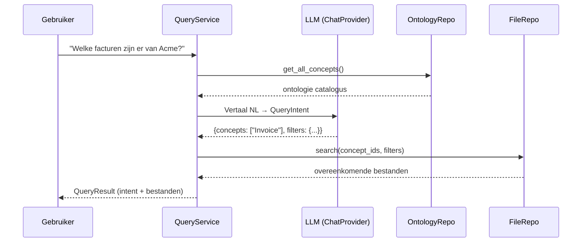

# Query Module — Documentatie

## Overzicht

De **Query Module** stelt gebruikers in staat om vragen te stellen in natuurlijke taal (in elke taal), die vervolgens automatisch vertaald worden naar ontologie-specifieke zoektermen. De module doorzoekt vervolgens de kennisdatabase en retourneert relevante bestanden als contextdata.

## Architectuur

De queryverwerking verloopt in **twee fasen**:

### Fase 1: Intent Resolution (Intentherkenning)

Het LLM (Large Language Model) ontvangt:
- De oorspronkelijke vraag van de gebruiker
- Een compacte samenvatting van de ontologie (concept-ID's, labels, synoniemen, eigenschapsnamen)

Het LLM retourneert een gestructureerd JSON-object (`QueryIntent`) met:
- **`concept_ids`**: Welke ontologieconcepten de vraag betreft (bijv. `["Invoice"]`)
- **`metadata_filters`**: Metadata-filters afgeleid uit de vraag (bijv. `vendor_name contains "Acme"`)
- **`keywords`**: Relevante zoektermen
- **`text_query`**: Een optionele full-text zoekopdracht
- **`resolved_language`**: De gedetecteerde taal van de vraag
- **`reasoning`**: Korte uitleg van de interpretatie

### Fase 2: Database Search (Database zoeken)

De `FileRepository.search()` methode doorzoekt verwerkte bestanden met behulp van:
- `concept_id IN (...)` voor conceptfilters
- PostgreSQL JSONB `@>` containment voor metadata-filters
- `ILIKE` voor full-text zoekopdrachten
- Resultaten gesorteerd op classificatiebetrouwbaarheid (aflopend)



## Domain Entiteiten

### `QueryIntent`

Bevat de gestructureerde zoekintentie die door het LLM is opgelost:

```python
@dataclass
class QueryIntent:
    original_question: str          # Oorspronkelijke vraag
    resolved_language: str          # Gedetecteerde taal
    concept_ids: list[str]          # Ontologie concept-ID's
    concept_labels: list[str]       # Mensleesbare labels
    metadata_filters: list[MetadataFilter]  # Metadata-filters
    keywords: list[str]             # Relevante zoektermen
    text_query: str | None          # Full-text zoekopdracht
    reasoning: str                  # LLM uitleg
```

### `MetadataFilter`

Vertegenwoordigt een enkel metadata-filter:

```python
@dataclass
class MetadataFilter:
    field_name: str                 # Naam van het metadata-veld
    value: str                      # Zoekwaarde
    operator: str = "contains"      # "contains" | "equals" | "gte" | "lte"
```

### `QueryMatch`

Een enkel bestand dat overeenkomt met de zoekopdracht:

```python
@dataclass
class QueryMatch:
    file_id: str                    # Uniek bestand-ID
    filename: str                   # Bestandsnaam
    concept_id: str | None          # Geclassificeerd concept
    confidence: float               # Classificatiebetrouwbaarheid (0-1)
    summary: str | None             # Samenvatting van het bestand
    metadata: dict[str, Any]        # Geëxtraheerde metadata
```

### `QueryResult`

Het volledige queryresultaat:

```python
@dataclass
class QueryResult:
    intent: QueryIntent             # De opgeloste intentie
    matches: list[QueryMatch]       # Overeenkomende bestanden
    total_matches: int              # Totaal aantal overeenkomsten
```

## API Endpoints

### `POST /api/v1/query`

Voert een volledige query uit: vertaalt de vraag en doorzoekt de database.

**Request body:**

```json
{
    "question": "Welke facturen zijn er van Acme?",
    "max_results": 20
}
```

**Response:**

```json
{
    "intent": {
        "original_question": "Welke facturen zijn er van Acme?",
        "resolved_language": "nl",
        "concept_ids": ["Invoice"],
        "concept_labels": ["Invoice"],
        "metadata_filters": [
            {"field_name": "vendor_name", "value": "Acme", "operator": "contains"}
        ],
        "keywords": ["factuur", "Acme"],
        "text_query": null,
        "reasoning": "De gebruiker vraagt naar facturen van Acme."
    },
    "matches": [
        {
            "file_id": "abc-123",
            "filename": "factuur_acme_jan2025.pdf",
            "concept_id": "Invoice",
            "confidence": 0.95,
            "summary": "Factuur van Acme Corp voor diensten januari 2025",
            "metadata": {"vendor_name": "Acme Corp", "amount": "1250.00"}
        }
    ],
    "total_matches": 1
}
```

### `POST /api/v1/query/intent`

Lost alleen de intentie op (geen zoekopdracht) — handig voor debugging.

**Request body:** Identiek aan `/query`

**Response:** Alleen het `QueryIntentSchema` object.

## QueryService

De `QueryService` coördineert het volledige queryproces:

```python
class QueryService:
    async def query(question: str, max_results: int = 20) -> QueryResult:
        """Volledige flow: intentherkenning → database zoeken."""

    async def resolve_intent(question: str) -> QueryIntent:
        """Fase 1: LLM vertaalt vraag naar gestructureerde intentie."""

    async def execute_query(intent: QueryIntent, max_results: int = 20) -> QueryResult:
        """Fase 2: Doorzoek de database met de opgeloste filters."""
```

### Ontologiecontext

De service bouwt automatisch een compacte ontologiesamenvatting voor de LLM-prompt. Alleen **niet-abstracte** concepten worden opgenomen, inclusief:
- Concept-ID en label
- Beschrijving (eerste 200 tekens)
- Synoniemen
- Eigenschapsnamen en -typen

### Foutafhandeling

Als het LLM een ongeldige JSON-response retourneert, valt de service terug op een basis-intentie met de oorspronkelijke vraag als full-text zoekopdracht.

## Frontend

De frontend biedt een interactieve querypagina op `/query` met:

1. **Zoekinvoer** — Typ een vraag in natuurlijke taal
2. **AI Interpretatie-kaart** — Toont de opgeloste concepten, filters, trefwoorden en taal
3. **Resultatenlijst** — Kaarten voor elk overeenkomend bestand met classificatie, samenvatting en metadata
4. **Navigatie** — Klik op een resultaat om naar de bestandsdetailpagina te gaan
5. **Suggesties** — Voorbeeldvragen om mee te beginnen

## Testen

De module bevat 9 unittests die alle kernfunctionaliteit dekken:

| Test | Beschrijving |
|------|-------------|
| `test_parses_valid_json_from_llm` | Parseert gestructureerde JSON correct |
| `test_parses_json_with_markdown_fences` | Verwijdert markdown code-blokken rondom JSON |
| `test_fallback_on_invalid_json` | Valt terug bij ongeldige LLM-response |
| `test_ontology_context_excludes_abstract` | Abstracte concepten worden uitgesloten |
| `test_usage_is_logged` | LLM-gebruik wordt gelogd |
| `test_search_by_concept_ids` | Zoekt bestanden op concept-ID's |
| `test_empty_intent_returns_all` | Lege intentie retourneert alle bestanden |
| `test_max_results_limits_output` | Respecteert het maximale resultaten |
| `test_full_query_combines_intent_and_search` | End-to-end flow werkt correct |

### Tests uitvoeren

```bash
cd /Users/plifortigo/development/personal/knowledge-base/backend
.venv/bin/python -m pytest tests/unit/test_query_service.py -v
```
