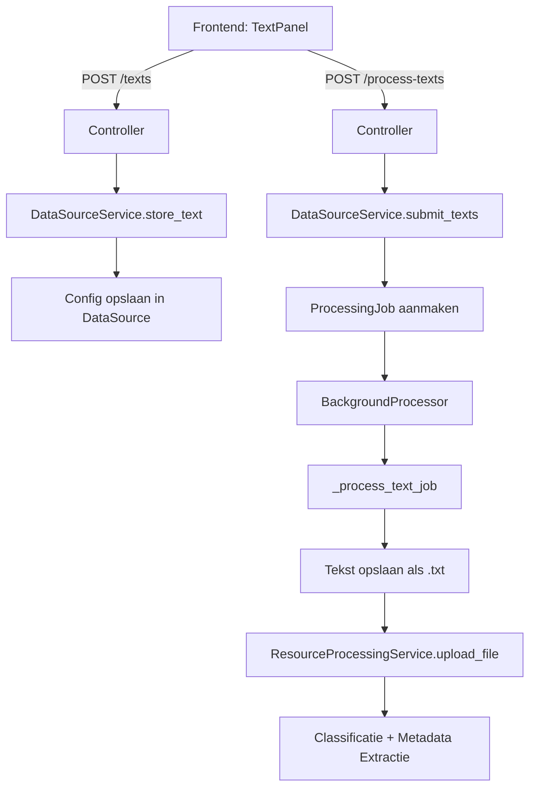

# Tekst Databron

## Overzicht

De **tekst-databron** is een bron-type waarmee gebruikers platte tekst kunnen plakken als input voor de kennisbank. Dit stelt gebruikers in staat om direct tekst toe te voegen zonder bestanden te uploaden of website-URLs op te geven. De tekst doorloopt vervolgens dezelfde verwerkingspipeline als bestandsuploads: tekstextractie → classificatie → metadata-extractie → embedding-generatie.

## Architectuur

De tekst-databron volgt exact dezelfde clean architecture-patronen als de bestaande `file_upload` en `website` brontypen.



## Backend Implementatie

### Domain Laag

In `backend/app/domain/entities/data_source.py` is `TEXT = "text"` toegevoegd aan de `DataSourceType` enum:

```python
class DataSourceType(str, Enum):
    FILE_UPLOAD = "file_upload"
    WEBSITE = "website"
    TEXT = "text"
```

De configuratie voor een tekst-databron slaat tekst-entries op als JSON-objecten:

```json
{
  "texts": [
    {
      "id": "uuid-...",
      "title": "Vergadernotities Q1",
      "content": "De volledige tekst inhoud...",
      "char_count": 1234,
      "created_at": "2026-02-20T12:00:00Z"
    }
  ]
}
```

### Application Laag — Schema's

In `backend/app/application/schemas/data_source.py` zijn vier nieuwe Pydantic-schema's toegevoegd:

| Schema | Doel |
|---|---|
| `SubmitTextRequest` | Request body met `title` en `content` velden |
| `SourceTextEntry` | Metadata per opgeslagen tekst-entry |
| `SourceTextsResponse` | Response met alle tekst-entries voor een bron |
| `ProcessTextsRequest` | Request body met `text_ids` om te verwerken |

### Application Laag — Service

In `backend/app/application/services/data_source_service.py` zijn vier methoden toegevoegd:

| Methode | Functionaliteit |
|---|---|
| `store_text(source_id, title, content)` | Slaat een tekst-entry op in de config |
| `get_source_texts(source_id)` | Retourneert alle opgeslagen tekst-entries |
| `remove_source_text(source_id, text_id)` | Verwijdert een entry uit de config |
| `submit_texts(source_id, text_ids)` | Maakt verwerkingsjobs aan met `resource_type="text"` |

### Presentatie Laag — Controller

In `backend/app/presentation/api/v1/data_sources_controller.py` zijn vier endpoints toegevoegd:

| Endpoint | Methode | Beschrijving |
|---|---|---|
| `/{source_id}/texts` | `GET` | Lijst van opgeslagen tekst-entries |
| `/{source_id}/texts` | `POST` | Nieuwe tekst-entry toevoegen |
| `/{source_id}/texts` | `DELETE` | Tekst-entry verwijderen (via `text_id` query param) |
| `/{source_id}/process-texts` | `POST` | Geselecteerde teksten indienen voor verwerking |

### Achtergrondverwerking

In `backend/app/application/services/background_processor.py` is de `_process_text_job` methode toegevoegd. De pipeline werkt als volgt:

1. **Tekst-entry ophalen**: De tekst wordt opgezocht in `DataSource.config["texts"]` via het `text_id`
2. **Opslaan als bestand**: De tekst wordt gecodeerd als UTF-8 en opgeslagen als `.txt`-bestand via `LocalFileStorage`
3. **Delegatie naar bestandspipeline**: `ResourceProcessingService.upload_file()` wordt aangeroepen, waardoor de bestaande classificatie- en metadata-extractiepipeline hergebruikt wordt

## Frontend Implementatie

### Types

In `frontend/src/types/data-sources.ts` is `'text'` toegevoegd aan het `DataSourceType` union-type, samen met de bijbehorende interfaces:

```typescript
export type DataSourceType = 'file_upload' | 'website' | 'text';

export interface SourceTextEntry {
    id: string;
    title: string;
    content: string;
    char_count: number;
    created_at: string;
}
```

### API Client

In `frontend/src/lib/data-sources-api.ts` zijn vier methoden toegevoegd:

- `getTexts(sourceId)` — Haalt opgeslagen tekst-entries op
- `addText(sourceId, request)` — Voegt een nieuwe tekst-entry toe
- `removeText(sourceId, textId)` — Verwijdert een tekst-entry
- `processTexts(sourceId, request)` — Verwerkt geselecteerde teksten

### UI Componenten

#### `TextPanel`
Het hoofdpaneel voor tekst-databronnen met:
- **Tekst invoerformulier**: Titel-input + textarea voor content met live tekentelller
- **Opgeslagen teksten lijst**: Selecteerbare lijst met titel, tekengrootte en datum
- **Verwerkingsknoppen**: "Process Selected" en "Process All" knoppen

#### `AddSourceForm`
De `AddWebsiteForm` is vervangen door een generieke `AddSourceForm` met een type-selector (segmented control) waarmee gebruikers het brontype kunnen kiezen: Website, Text, of File Upload.

#### `SourceTypeIcon`
Een herbruikbaar component dat het juiste icoon en kleur toont per brontype:
- 🔵 Website → Globe icoon (blauw)
- 🟣 Text → FileText icoon (paars)
- 🟢 File Upload → FileUp icoon (groen)

## Gebruik

1. Navigeer naar **Data Sources** in de sidebar
2. Klik op **Add Source**
3. Selecteer **Text** als brontype
4. Geef de bron een naam en optionele beschrijving
5. Open de aangemaakte bron
6. Plak tekst met een titel in het formulier
7. Klik op **Add Text** om de tekst op te slaan
8. Selecteer tekst-entries en klik op **Process Selected** om de verwerking te starten
