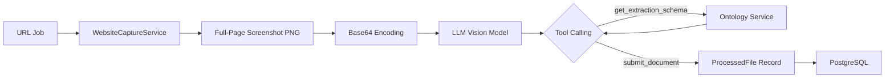

# Website Capture Module — Technische Documentatie

## Inleiding

De Website Capture module maakt gebruik van **Playwright** (headless Chromium) om full-page screenshots te maken van webpagina's. Deze screenshots worden vervolgens door een **LLM vision model** geanalyseerd om gestructureerde data te extraheren op basis van het ontologiesysteem.

Dit vervangt de eerdere, eenvoudige `httpx`-gebaseerde tekstextractie met een visueel-eerste benadering. Door de volledige pagina als afbeelding te verwerken, kan het systeem informatie extraheren die anders onzichtbaar zou zijn (tabellen, grafieken, gestileerde tekst, afbeeldingen met tekst).

## Architectuur

De module is opgebouwd volgens **Clean Architecture**-principes en integreert naadloos met de bestaande `BackgroundProcessor`-daemon.

### Componenten

| Component | Laag | Verantwoordelijkheid |
|-----------|------|---------------------|
| `WebsiteCaptureService` | Infrastructure | Playwright browser lifecycle, screenshot capture |
| `process_image_with_tools()` | Application Interface | Abstracte methode voor LLM vision + tool calling |
| `OpenRouterLLMClient` | Infrastructure | Concrete implementatie met OpenRouter API |
| `BackgroundProcessor` | Application | Orchestratie van de capture → vision → opslag pipeline |

### Dataflow



## WebsiteCaptureService

### Theorie

Veel websites laden content dynamisch via JavaScript, gebruiken lazy-loading voor afbeeldingen, en tonen cookie-banners die de content blokkeren. Een eenvoudige HTTP-request mist al deze elementen. Playwright lost dit op door een volledige browser te draaien die:

1. **JavaScript uitvoert** — SPA's en dynamische content worden volledig gerenderd
2. **Cookie-scripts blokkeert** — consent-scripts worden onderschept vóór navigatie via route interception
3. **Cookie-banners wegklikt** — automatische detectie en dismissal via CSS-selectors en tekst-matching
4. **Cookie-elementen verwijdert** — DOM-elementen worden volledig verwijderd (niet alleen verborgen)
5. **Lazy content triggert** — programmatisch scrollen om alle content te laden
6. **Wacht op netwerk-idle** — geen screenshots nemen terwijl er nog XHR-requests lopen

### Configuratie

| Setting | Type | Default | Beschrijving |
|---------|------|---------|-------------|
| `website_capture_viewport_width` | `int` | `1280` | Breedte viewport (pixels) |
| `website_capture_viewport_height` | `int` | `800` | Hoogte viewport (pixels) |
| `website_capture_timeout` | `int` | `30` | Maximale wachttijd per pagina (seconden) |

### API

```python
from app.infrastructure.capture.website_capture_service import (
    WebsiteCaptureService,
    CapturedPage,
)

# Lifecycle
service = WebsiteCaptureService(viewport_width=1280, viewport_height=800)
await service.start()   # Launch headless Chromium
# ...
await service.stop()    # Close browser

# Screenshot capture
captured: CapturedPage = await service.capture_screenshot("https://example.com")
# captured.url, captured.title, captured.screenshot_bytes, captured.captured_at
```

### Cookie-afhandeling — Defense-in-Depth (6 strategieën)

De service past een **gelaagde aanpak** toe om cookie-banners en consent-overlays zo volledig mogelijk te elimineren. Elke strategie vangt cases op die voorgaande strategieën missen.

#### Strategie 0: Route Interception (pre-navigatie)

Voordat de pagina wordt geladen, worden bekende consent-platform scripts geblokkeerd via `context.route()`. Dit voorkomt dat cookie-banners überhaupt in de DOM worden geïnjecteerd.

```python
_BLOCKED_CONSENT_SCRIPT_PATTERNS = [
    "*cookieyes.com*",
    "*cookiebot.com*",
    "*cdn.cookielaw.org*",
    "*onetrust.com*",
    "*didomi.io*",
    "*termly.io*",
    "*iubenda.com*",
    # ... 21 patronen totaal
]
```

**Voordeel:** Geen banner, geen probleem. De banner wordt nooit gerenderd.

**Beperking:** Detecteert alleen bekende third-party scripts. Custom cookie-implementaties worden niet geblokkeerd.

#### Strategie 1: CSS Selector Dismissal

Na het laden van de pagina worden bekende accept-knoppen aangeklikt via CSS-selectors:

```python
_ACCEPT_BUTTON_SELECTORS = [
    "#onetrust-accept-btn-handler",
    "#CybotCookiebotDialogBodyLevelButtonLevelOptinAllowAll",
    "[data-cky-tag='accept-button']",
    # ... 90+ selectors
]
```

#### Strategie 2: Tekst-matching

Zoekt visible buttons waarvan de tekst overeenkomt met accept/akkoord-patronen in meerdere talen:

```python
_ACCEPT_TEXT_PATTERNS = [
    "accept all", "accept cookies", "akkoord",
    "alles accepteren", "alle akzeptieren",
    "tout accepter", "aceptar todo",
    # ... 40+ patronen (EN/NL/DE/FR/ES)
]
```

#### Strategie 3: Viewport-blocking Overlay Detectie

Detecteert fixed/sticky elementen die >40% van de viewport bedekken. Klikt op buttons erin, of verbergt het element als er geen button is.

#### Strategie 4: DOM Removal (was: CSS Injection)

Verwijdert bekende cookie/consent containers **volledig uit de DOM** via `el.remove()`. Dit is effectiever dan de eerdere CSS-injection (`display: none !important`), omdat verwijderde elementen niet meer in screenshots verschijnen.

```javascript
const selectors = [
    '#onetrust-banner-sdk',
    '.cky-consent-container',
    '[class*="cookie-banner"]',
    // ... 30+ selectors
];
for (const sel of selectors) {
    document.querySelectorAll(sel).forEach(el => el.remove());
}
```

#### Strategie 5: Tekst-gebaseerde Cookie Element Cleanup

Scant alle resterende fixed/sticky elementen voor cookie-gerelateerde trefwoorden en verwijdert ze uit de DOM:

```javascript
const keywords = [
    'cookie', 'consent', 'gdpr', 'privacy policy',
    'cookie policy', 'cookiebeleid', 'we use cookies',
    'wij gebruiken cookies', 'cookie-instellingen',
];
```

**Voordeel:** Vangt custom cookie-banners op die geen bekende CSS-selectors gebruiken.

### Lazy-Load Scrolling

Na navigatie scrollt de service programmatisch door de volledige pagina om lazy-loaded afbeeldingen en content te triggeren:

```javascript
async () => {
    const height = document.body.scrollHeight;
    const step = window.innerHeight;
    for (let y = 0; y < height; y += step) {
        window.scrollTo(0, y);
        await delay(200);  // 200ms per stap
    }
    window.scrollTo(0, 0);  // Terug naar boven
}
```

## LLM Vision Processing

### Tool-Calling Workflow

De LLM vision pipeline volgt exact hetzelfde **tool-calling patroon** als de bestaande PDF-verwerking:

1. **Analyse**: LLM ontvangt screenshot + concept-catalogus
2. **Classificatie**: LLM bepaalt het meest passende concept
3. **Schema ophalen**: LLM roept `get_extraction_schema(concept_id)` aan
4. **Extractie**: LLM extraheert data volgens het schema
5. **Submitten**: LLM roept `submit_document(concept_id, properties, ...)` aan

### System Prompt

De `_IMAGE_TOOL_SYSTEM_PROMPT` is specifiek ontworpen voor webpagina-screenshots:

- **Focus op primaire content** — navigatie, advertenties, en footers worden genegeerd
- **Cookie/privacy-content wordt genegeerd** — de prompt instrueert het model expliciet om cookie-banners, privacybeleid en GDPR-tekst over te slaan
- **Multi-item ondersteuning** — als een pagina een lijst/tabel bevat, wordt elk item apart gesubmit
- **Dezelfde formatregels** als PDF-verwerking (ISO 8601 datums, numerieke bedragen, reference objects)

### Voorbeeld

```python
results = await llm_client.process_image_with_tools(
    image_base64=base64.b64encode(screenshot_bytes).decode("ascii"),
    mime_type="image/png",
    source_url="https://example.com/products",
    available_concepts=[
        {"id": "Product", "label": "Product", "description": "...", "synonyms": [], "hints": []}
    ],
    tool_handler=my_tool_handler,
)

# results: [LLMPdfProcessingResponse(concept_id="Product", confidence=0.95, ...)]
```

## BackgroundProcessor Pipeline

### URL Job Flow

```python
async def _process_url_job(self, job, file_service, repo, session):
    # 1. Capture screenshot via Playwright
    captured = await self._capture_service.capture_screenshot(url)
    
    # 2. Store screenshot on disk for reference
    screenshot_path = upload_dir / f"{uuid4()}.png"
    screenshot_path.write_bytes(captured.screenshot_bytes)
    
    # 3. Fetch ontology concepts for classification
    classifiable = await ontology_repo.get_classifiable_concepts()
    
    # 4. Encode screenshot as base64
    image_base64 = base64.b64encode(captured.screenshot_bytes).decode("ascii")
    
    # 5. LLM vision processing with tool calling
    results = await llm_client.process_image_with_tools(...)
    
    # 6. Create ProcessedFile records for each extracted item
    for result in results:
        pf = ProcessedFile(
            classification=ClassificationResult(
                primary_concept_id=result.concept_id,
                confidence=result.confidence,
                signals=[ClassificationSignal(method="llm_vision", ...)]
            ),
            metadata=result.extracted_properties,
            ...
        )
        await file_repo.create(pf)
```

### SSE Updates

Tijdens verwerking worden real-time status updates naar de frontend gebroadcast via Server-Sent Events:

| Stap | `progress_message` |
|------|-------------------|
| Start | `Capturing screenshot: {url}` |
| Na capture | `Classifying content from: {title}` |
| LLM processing | `Extracting data from screenshot ({n} concepts)` |
| Compleet | Job marked as `completed` met `result_file_id` |

## Dependencies

```
playwright==1.58.0
```

Na installatie van het pip-package moeten de browser-binaries geïnstalleerd worden:

```bash
playwright install chromium
```

## Bestandsoverzicht

| Bestand | Beschrijving |
|---------|-------------|
| `app/infrastructure/capture/website_capture_service.py` | Playwright browser lifecycle en screenshot capture |
| `app/infrastructure/capture/__init__.py` | Package init |
| `app/application/interfaces/llm_client.py` | `process_image_with_tools()` abstracte methode |
| `app/infrastructure/llm/openrouter_llm_client.py` | Implementatie + `_IMAGE_TOOL_SYSTEM_PROMPT` |
| `app/application/services/background_processor.py` | URL job pipeline met vision processing |
| `app/main.py` | WebsiteCaptureService lifecycle in lifespan |
| `app/config.py` | Website capture instellingen |
